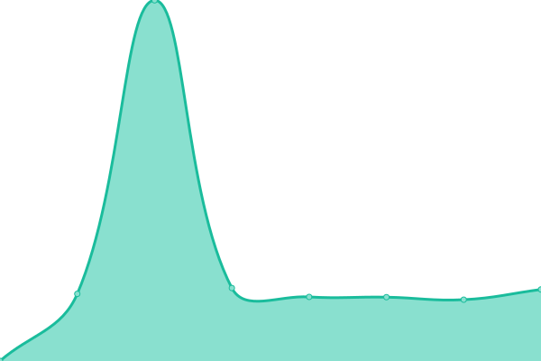

# [📈 Live Status](https://NajadaGames.github.io/Upptime): <!--live status--> **🟩 All systems operational**

This repository contains the open-source uptime monitor and status page for [Najada Games](https://www.najada.games/), powered by [Upptime](https://github.com/upptime/upptime).

With [Upptime](https://upptime.js.org), you can get your own unlimited and free uptime monitor and status page, powered entirely by a GitHub repository. We use [Issues](https://github.com/NajadaGames/Upptime/issues) as incident reports, [Actions](https://github.com/NajadaGames/Upptime/actions) as uptime monitors, and [Pages](https://NajadaGames.github.io/Upptime) for the status page.

<!--start: status pages-->
<!-- This summary is generated by Upptime (https://github.com/upptime/upptime) -->
<!-- Do not edit this manually, your changes will be overwritten -->
<!-- prettier-ignore -->
| URL | Status | History | Response Time | Uptime |
| --- | ------ | ------- | ------------- | ------ |
|  [Najada FE](https://www.najada.games/) | 🟩 Up | [najada-fe.yml](https://github.com/NajadaGames/Upptime/commits/HEAD/history/najada-fe.yml) | 

 959ms
     
 | 

<a href="https://NajadaGames.github.io/Upptime/history/najada-fe">100.00%</a>
    

|  [Najada BE](https://najada.games/api/v1/auth/hello/) | 🟩 Up | [najada-be.yml](https://github.com/NajadaGames/Upptime/commits/HEAD/history/najada-be.yml) | 

 861ms
     
 | 

<a href="https://NajadaGames.github.io/Upptime/history/najada-be">100.00%</a>
    

|  [Magic Card Buyer FE](https://magiccardbuyer.eu/) | 🟩 Up | [magic-card-buyer-fe.yml](https://github.com/NajadaGames/Upptime/commits/HEAD/history/magic-card-buyer-fe.yml) | 

 694ms
     
 | 

<a href="https://NajadaGames.github.io/Upptime/history/magic-card-buyer-fe">100.00%</a>
    

|  [Magic Card Buyer BE](https://client.magiccardbuyer.eu/search/?q=akroma&page=1) | 🟩 Up | [magic-card-buyer-be.yml](https://github.com/NajadaGames/Upptime/commits/HEAD/history/magic-card-buyer-be.yml) | 

 2276ms
     
 | 

<a href="https://NajadaGames.github.io/Upptime/history/magic-card-buyer-be">100.00%</a>
    

<!--end: status pages-->

[**Visit our status website →**](https://NajadaGames.github.io/Upptime)

## 📄 License

- Powered by: [Upptime](https://github.com/upptime/upptime)
- Code: [MIT](./LICENSE) © [Anand Chowdhary](https://anandchowdhary.com), supported by [Pabio](https://pabio.com)
- Data in the `./history` directory: [Open Database License](https://opendatacommons.org/licenses/odbl/1-0/)
